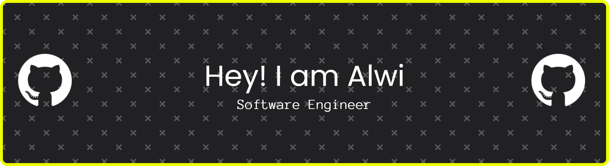

<p align="center">  </p>

Konnichiwa minna~! (≧◡≦) ♡ I’m Alwi, a passionate Software Engineer from Indonesia 🇮🇩✨ with 3+ years of experience in web development, mostly focusing on frontend. I love working with modern JavaScript ecosystems to build scalable, maintainable, and user-friendly applications (๑˃ᴗ˂)ﻭ  

My main tech stack is JavaScript / TypeScript, React, Next.js, and Laravel 💻💕 with a strong interest in frontend architecture, building complex products, and software engineering in general (｀・ω・´)✨ Currently learning Golang & Docker to level up my backend and system skills little by little 🌱  

I enjoy working on complex systems, building projects together, creating side projects, and continuously improving my programming skills 🚀✨ My dream is to become an engineer comparable to top engineers from India & China, work and study abroad 🌏, and build my own SaaS business one day 💡💖  

I also love talking about tech, productivity, work, and studying abroad — let’s grow together~! (｡•̀ᴗ-)✧


<!--START_SECTION:waka-->
**I'm an Early 🐤** 

```text
🌞 Morning                155 commits         █████████░░░░░░░░░░░░░░░░   34.52 % 
🌆 Daytime                86 commits          █████░░░░░░░░░░░░░░░░░░░░   19.15 % 
🌃 Evening                158 commits         █████████░░░░░░░░░░░░░░░░   35.19 % 
🌙 Night                  50 commits          ███░░░░░░░░░░░░░░░░░░░░░░   11.14 % 
```
📅 **I'm Most Productive on Sunday** 

```text
Monday                   34 commits          ██░░░░░░░░░░░░░░░░░░░░░░░   07.57 % 
Tuesday                  47 commits          ███░░░░░░░░░░░░░░░░░░░░░░   10.47 % 
Wednesday                53 commits          ███░░░░░░░░░░░░░░░░░░░░░░   11.80 % 
Thursday                 49 commits          ███░░░░░░░░░░░░░░░░░░░░░░   10.91 % 
Friday                   74 commits          ████░░░░░░░░░░░░░░░░░░░░░   16.48 % 
Saturday                 95 commits          █████░░░░░░░░░░░░░░░░░░░░   21.16 % 
Sunday                   97 commits          █████░░░░░░░░░░░░░░░░░░░░   21.60 % 
```


📊 **This Week I Spent My Time On** 

```text
🕑︎ Time Zone: Asia/Jakarta

💬 Programming Languages: 
TypeScript               14 hrs 39 mins      ███████████████████░░░░░░   74.48 % 
Python                   3 hrs 13 mins       ████░░░░░░░░░░░░░░░░░░░░░   16.36 % 
Bash                     1 hr                █░░░░░░░░░░░░░░░░░░░░░░░░   05.09 % 
JSON                     21 mins             ░░░░░░░░░░░░░░░░░░░░░░░░░   01.81 % 
HTML                     16 mins             ░░░░░░░░░░░░░░░░░░░░░░░░░   01.38 % 
```

**I Mostly Code in TypeScript** 

```text
TypeScript               16 repos            █████████░░░░░░░░░░░░░░░░   36.36 % 
JavaScript               13 repos            ███████░░░░░░░░░░░░░░░░░░   29.55 % 
Blade                    7 repos             ████░░░░░░░░░░░░░░░░░░░░░   15.91 % 
Astro                    1 repo              █░░░░░░░░░░░░░░░░░░░░░░░░   02.27 % 
PHP                      1 repo              █░░░░░░░░░░░░░░░░░░░░░░░░   02.27 % 
```


<!--END_SECTION:waka-->
